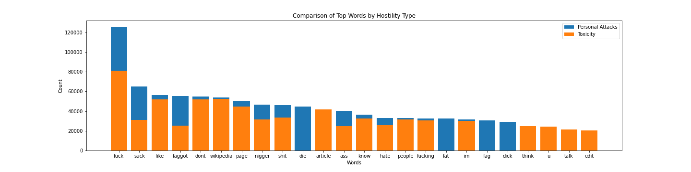

# data-512-a2
This folder contains a tutorial for how to analyze hostile speech data from Wikipedia Talk data to understand potential biases that would propagate through downstream models and applications trained with this data. 
## Goal 
Perform analyses on Wikipedia Talk data to identify potential sources of bias in a corpus of human-annotated data, and describe implications of those biases.

## Input
The source data is too big to be shared in the repo, however, it can be accessed directly from the source at the figsahre links below. 
- Wulczyn, Ellery; Thain, Nithum; Dixon, Lucas (2017): Wikipedia Talk Labels: Personal Attacks. figshare. Dataset. https://doi.org/10.6084/m9.figshare.4054689.v6
- Wulczyn, Ellery; Thain, Nithum; Dixon, Lucas (2017): Wikipedia Talk Labels: Aggression. figshare. Dataset. https://doi.org/10.6084/m9.figshare.4267550.v5
- Thain, Nithum; Dixon, Lucas; Wulczyn, Ellery (2017): Wikipedia Talk Labels: Toxicity. figshare. Dataset. https://doi.org/10.6084/m9.figshare.4563973.v2
- Wulczyn, Ellery; Thain, Nithum; Dixon, Lucas (2017): Wikipedia Talk Corpus. figshare. Dataset. https://doi.org/10.6084/m9.figshare.4264973.v3
    
## Output
Research Question 1: Are certain words more likely to be associated with comments labelled as hostile speech? Are there certain words that are frequently associated with one type of hostile speech (like “personal attacks”) but not others (like “toxicity”)?

Research Question 2: Are different demographic profiles of workers more sensitive to one type of hostile speech than another? For example, do women more frequently label comments as personal attacks than men? Is there higher frequency of female workers labelling comments as personal attacks rather than toxic?

  
## Sources
Google data scientist use this data to train models for use in a host of applications. 
- [Perspectives API](https://github.com/conversationai/perspectiveapi/wiki/perspective-hacks)
- [Conversation AI](https://conversationai.github.io/)
